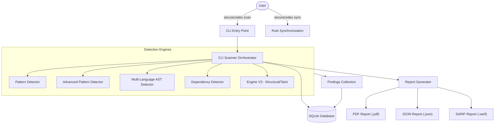

# SecureCodeX-CLI Working Workflow

This document provides a detailed overview of the SecureCodeX-CLI architecture and its internal scanning logic.

## 1. High-Level Architecture

The tool follows a classic CLI-based scanning architecture, separating rule synchronization, orchestration, detection logic, and reporting.




---

## 2. Engine V3: Multi-Phase Analysis Pipeline

Engine V3 is the modern core of SecureCodeX, implementing high-fidelity analysis through multiple phases to balance speed and precision.


```mermaid
flowchart LR
    Start([File Content]) --> L0[Phase 0: L0 Pre-filter]
    L0 -- "Keyword Match" --> Parse{AST Parsing}
    L0 -- "No Keywords" --> Skip([Skip File])
    
    Parse -- "Success" --> L1[Phase 1: L1 Structural Matching]
    Parse -- "Failure" --> Fallback[Phase 3: Fallback Regex Scan]
    
    L1 --> L2[Phase 2: L2 Taint Analysis]
    L2 --> Dedup[Deduplication]
    Fallback --> Dedup
    
    Dedup --> Result([Findings])

    subgraph Phase_Details
        L0 -.- "Fast byte-string search for rule-specific keywords"
        L1 -.- "Tree-sitter structural pattern matching"
        L2 -.- "Source-to-sink data flow tracking"
    end
```

---

## 3. Granular Process Flow (Separated Processes)

The following diagram illustrates the distinct operational zones of SecureCodeX, from initial input to final report generation.


---

## 4. Data Flow Overview

| Step | Component | Action |
|:---|:---|:---|
| **1. Init** | `cli.py` | Parses arguments, validates paths, and creates a Scan record in the DB. |
| **2. Collect** | `scanner.py` | Recursively walks the target directory, filtering out git-ignored and binary files. |
| **3. Analyze** | `detectors/` | Each file is passed through enabled detectors (Regex, AST, Taint). |
| **4. Store** | `database.py` | Findings are batch-inserted into the SQLite database with metadata (CWE, Severity). |
| **5. Report** | `report.py` | Queries the DB for findings and generates formatted PDF/JSON outputs. |
| **6. Cleanup** | `cli.py` | Unless `--keep-db` is used, the temporary database is securely removed. |

---

## 4. Key Components Description

### CLI (`securecodex.cli`)
The interface for users. Handles command parsing (`scan`, `sync`), environment setup, and global error handling.

### Scanner (`securecodex.scanner`)
The main orchestrator. It manages the file system traversal, progress bars (`tqdm`), and coordinates between different detector modules.

### Engine V3 (`securecodex.core.engine_v3`)
The high-performance analysis engine. It uses:
- **DSL Parser**: Loads YAML rules.
- **Parser Manager**: Manages tree-sitter grammars.
- **Taint Engine**: Tracks data flow across variables and function calls.

### Rule Sync (`securecodex.core.rule_sync`)
Responsible for fetching and updating security rules from external repositories (e.g., Semgrep community rules), ensuring the tool stays up-to-date with the latest threats.
