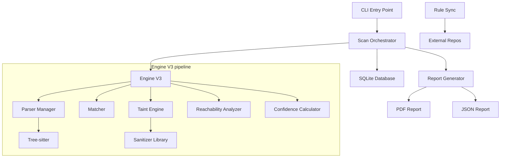

# Architecture Overview

This document provides a high-level overview of the SecureCodeX-CLI architecture and its internal data flow.

## 🧱 Component Diagram

The following diagram illustrates the primary components of SecureCodeX and their relationships.



## 🌊 Analysis Data Flow

When a scan is initiated, the data flows through the following stages:

1. **Initialization**: The CLI parses arguments and initializes the `DatabaseManager`.
2. **Orchestration**: The `CLIScanner` (Orchestrator) iterates through the target files.
3. **Detection**:
    - **L0 Filtering**: Fast keyword check to skip irrelevant rules.
    - **AST Generation**: Tree-sitter creates a concrete syntax tree.
    - **Matching**: `Matcher` finds structural hits.
    - **Tainting**: `TaintEngine` traces data flow if required.
4. **Verification**: `ReachabilityAnalyzer` checks if the finding is in dead code.
5. **Enrichment**: `ConfidenceCalculator` and `SanitizerLibrary` add context and scores.
6. **Persistence**: Findings are saved to the `SQLite` database.
7. **Reporting**: The `ReportGenerator` queries the database to produce final artifacts.

## 📂 Project Structure

- `securecodex/cli.py`: CLI command definitions.
- `securecodex/scanner.py`: Orchestration logic.
- `securecodex/core/`: Internal analysis engines.
- `securecodex/models.py`: Database schema.
- `rules/`: Bundled and synchronized security rules.
- `docs/`: Technical documentation.
```
