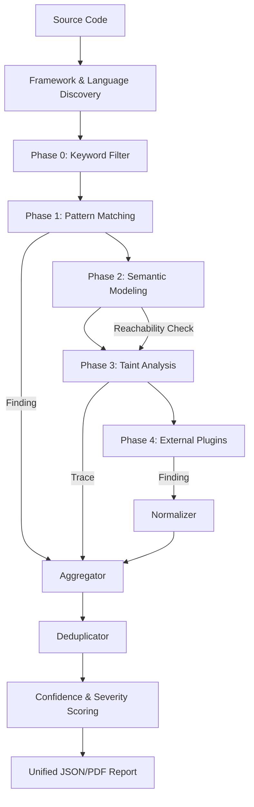

# SecureCodeX v2 Architecture Specification

This document details the architecture for SecureCodeX v2, a next-generation unified SAST engine. The design is informed by a deep technical analysis of Semgrep, CodeQL, and Horusec.

## 1. Analysis of Existing SAST Tools

### 1.1 Semgrep: Pattern-Based AST Matching
*   **Internal Operations:** Semgrep parses source code into an Abstract Syntax Tree (AST) (using tree-sitter or similar). It then applies rules written in a YAML-based DSL that uses code-like snippets (patterns) with metavariables and ellipses for matching.
*   **Analysis Types:** Primarily syntactic and structural matching. Supports data-flow aware pattern matching and "taint mode" for source-to-sink tracking.
*   **Strengths:** Extremely fast, rules are easy to write and look like code, low barrier to entry.
*   **Weaknesses:** Limited deep semantic analysis and inter-procedural tracking (though improving). Higher false-positive risk for complex vulnerabilities.

### 1.2 CodeQL: Database-Powered Semantic Analysis
*   **Internal Operations:** CodeQL uses an "Extractor" to convert source code into a relational database. Security researcher write queries in QL (a logic programming language) against this database.
*   **Analysis Layers:** AST -> Control Flow Graph (CFG) -> Static Single Assignment (SSA) -> Call Graph -> Data Flow / Taint Tracking.
*   **Strengths:** Industry-leading accuracy for complex, inter-procedural vulnerabilities. Highly flexible and programmable. Deep semantic understanding of code.
*   **Weaknesses:** Resource-intensive (long database build times, high CPU/RAM usage). High learning curve for QL.

### 1.3 Horusec: Multi-Analyzer Orchestration
*   **Internal Operations:** Horusec acts as an orchestrator that launches a suite of language-specific analyzers (e.g., Gosec, Bandit, Semgrep) in containers or locally. It then aggregates and normalizes the results.
*   **Analysis Types:** Varies depending on the orchestrated tool. Horusec itself focuses on discovery and finding consolidation.
*   **Strengths:** Broad language coverage by leveraging existing tools. Easy to integrate into CI/CD.
*   **Weaknesses:** Detection quality depends entirely on third-party tools. Can be slower due to Docker overhead.

---

## 2. SecureCodeX v2 Architecture

SecureCodeX v2 adopts a **Hybrid Multi-Phase Analysis** approach, combining the speed of Semgrep, the depth of CodeQL, and the extensibility of Horusec.

### 2.1 Core Scanning Engine (Hybrid)
The engine operates in four distinct phases to balance speed and accuracy:

1.  **Phase 0 (Keywords/L0):** Fast grep-based pre-filtering to skip irrelevant files and rules.
2.  **Phase 1 (Syntactic/L1):** Semgrep-style pattern matching on the AST for immediate structural wins (e.g., hardcoded secrets, misconfigurations).
3.  **Phase 2 (Semantic/L2):** Building a Control Flow Graph (CFG) and SSA form for control-flow aware analysis (e.g., reachability verification).
4.  **Phase 3 (Taint/L3):** Inter-procedural data flow tracking (CodeQL-style) to verify if user-controlled input reaches dangerous sinks.

### 2.2 Rule-Ingestion & Unified DSL
*   **Format:** A unified YAML-based DSL that supports both simple patterns and complex semantic constraints.
*   **Extensions:** Rules can define `pattern`, `pattern-not`, `pattern-sources`, `pattern-sinks`, and `semantic-constraints` (e.g., "must be reachable via call graph").

### 2.3 Plugin-Based Analyzer Framework
*   **Analyzers:** Native engines for core languages (Python, JS, Go).
*   **Extensibility:** Bridge for third-party tools (inspired by Horusec) to provide fallback coverage for niche languages.
*   **Normalization:** A dedicated layer to transform all findings into a unified `SecureCodeX-Json` format before deduplication.

### 2.4 Taint Analysis Engine (Phase 3)
*   **Mechanism:** Uses an Inter-procedural Control Flow Graph (ICFG) and Data Flow Graph (DFG).
*   **SSA-Aware:** Tracks data through assignments and variable re-use.
*   **Confidence Scoring:** Each finding is assigned a score based on path length, sanitizer presence, and reachability.

---

## 3. Integration & Rule Strategy

### 3.1 Reusing Existing Rules
*   **Semgrep:** Native YAML rule bridge. SecureCodeX v2 can ingest existing Semgrep rule sets and map them to Phase 1.
*   **CodeQL:** A "QL-transpiler" or a bridge to execute QL-inspired logic on SecureCodeX's internal semantic model.
*   **Horusec:** Adapting the analyzer profiles to launch non-native scanners when needed.

### 3.2 Finding Correlation
*   Overlapping findings from different phases (e.g., a Phase 1 pattern hit and a Phase 3 taint path) are **correlated** to increase confidence scores, rather than being reported as duplicates.

