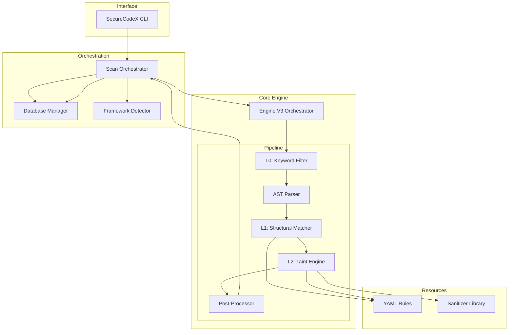

# System Architecture: SecureCodeX-CLI

This document outlines the system architecture of **SecureCodeX-CLI**, detailing its layering, component interactions, and technology stack.

## 1. Professional Architecture Visuals

````carousel

<!-- slide -->

````

---

## 2. Layered Architecture

SecureCodeX is built on a modular four-layer architecture, ensuring scalability and ease of maintenance.

### 2.1 Interface Layer (CLI)
- **Technology**: Python, `argparse`.
- **Function**: Handles user input, command orchestration (`scan`, `sync`), and output formatting.
- **Components**: `securecodex/cli.py`, `securecodex/scanner.py`.

### 2.2 Orchestration & Management Layer
- **Function**: Coordinates the scanning lifecycle, database interactions, and rule synchronization.
- **Components**: 
    - `DatabaseManager`: Handles finding persistence and history.
    - `RuleSync`: Maintains the `rules/` library from external and local sources.
    - `FrameworkDetector`: Analyzes the project structure to apply relevant rule sets.

### 2.3 Analysis Core (Engine V3)
- **Technology**: `tree-sitter`, Python.
- **Function**: Multi-phase vulnerability detection.
- **Phases**:
    1. **Pre-filtering**: Rapid heuristic checks to optimize engine performance.
    2. **Structural Matching**: AST-based pattern recognition for known insecure code shapes.
    3. **Taint Analysis**: Deep data-flow tracking from untrusted sources to sensitive sinks.
    4. **Post-Processing**: Metadata enrichment and confidence scoring based on reachability and framework context.

### 2.4 Data & Asset Layer
- **Persistence**: SQLite (Local Database).
- **Assets**: YAML-based Security Rules, Sanitizer Knowledge Base, Framework Signatures.

---

## 3. Technology Stack

| Category | Technology | Purpose |
| :--- | :--- | :--- |
| **Language** | Python 3.10+ | Core application logic and analysis engines. |
| **AST Parsing** | Tree-sitter | High-performance, incremental parsing for multiple languages. |
| **Database** | SQLite | Lightweight, zero-config persistence for scan history and findings. |
| **Reporting** | ReportLab | Generation of professional PDF security artifacts. |
| **Serialization** | YAML | Human-readable rule definition and configuration. |

---

## 4. Component Interaction Diagram



## 5. Security Design Principles
- **Defense in Depth**: Multi-layered analysis (Structural + Taint) ensures no single failure point in detection.
- **Context Awareness**: The engine understands framework protections and reachability to reduce noise.
- **Reproducibility**: Rules and sanitizers are version-controlled assets, ensuring consistent scan results.
