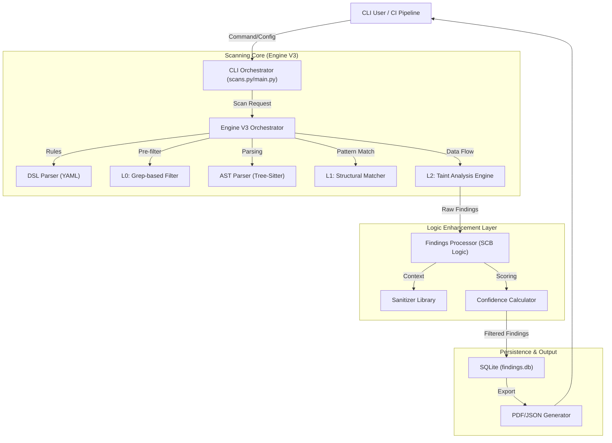
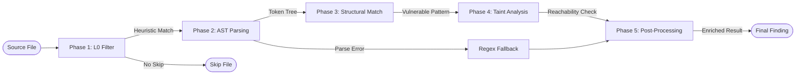
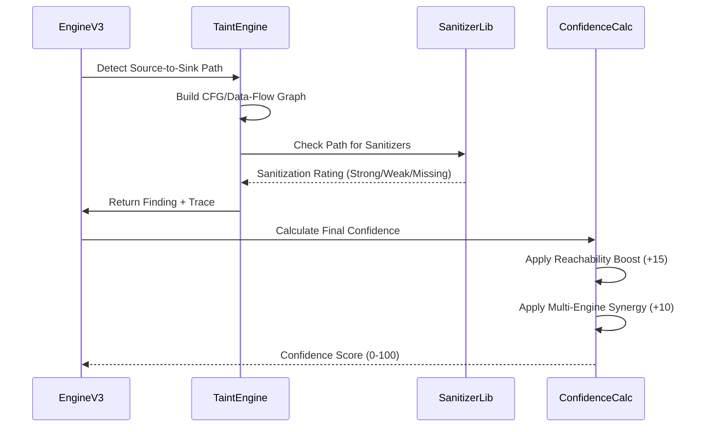

# SecureCodeX-CLI Professional Workflow & Architecture

This document provides a technical deep-dive into the SecureCodeX-CLI architecture, scanning pipeline, and data flow mechanisms.

## 1. High-Level System Architecture

The following diagram illustrates the interaction between the CLI user interface, the orchestration engine, and the core analysis components.

## 2. Engine V3: 5-Phase Analysis Pipeline

SecureCodeX employs a high-accuracy, multi-stage detection pipeline to balance performance and precision.

### Phase Details:
- **Phase 1 (L0 Filter)**: Rapid grep-based pre-filtering to skip irrelevant rules.
- **Phase 2 (AST Parsing)**: Conversion of source code into an Abstract Syntax Tree using `tree-sitter`.
- **Phase 3 (L1 Structural Match)**: Advanced pattern matching (metavariables, ellipses) to find dangerous code structures.
- **Phase 4 (L2 Taint Analysis)**: Deep data-flow tracking from source (user input) to sink (dangerous function).
- **Phase 5 (Post-Processing)**: Severity normalization, metadata injection (CWE/OWASP), and false-positive reduction via context analysis.

## 3. Taint Analysis Lifecycle

The following sequence diagram shows how data flow is verified across the system.

## 4. Key Component Responsibilities

| Component | Responsibility |
| :--- | :--- |
| **DSLParser** | Ingests YAML rules and converts them into internal `Rule` objects. |
| **EngineV3** | Orchestrates the entire scanning lifecycle for each file. |
| **FindingsProcessor** | Normalizes severities and injects rich metadata (CWE/OWASP IDs). |
| **SanitizerLibrary** | Cross-language database of safety functions and their effectiveness. |
| **ConfidenceCalculator** | Implementation of the 0-100 weighted scoring model for findings. |
| **PDFReportGenerator** | Professional report rendering with vulnerability descriptions and remediations. |
